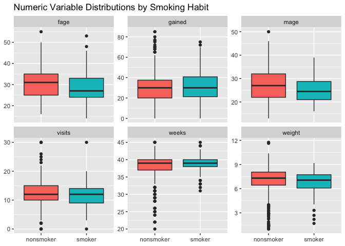
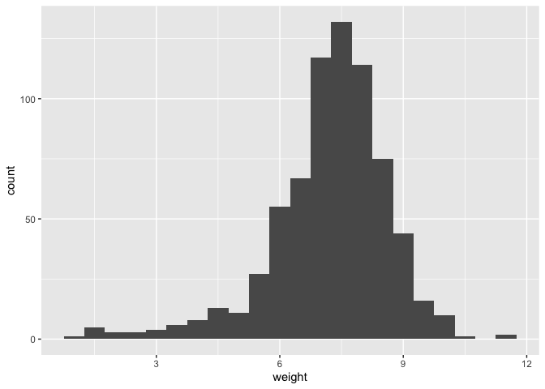
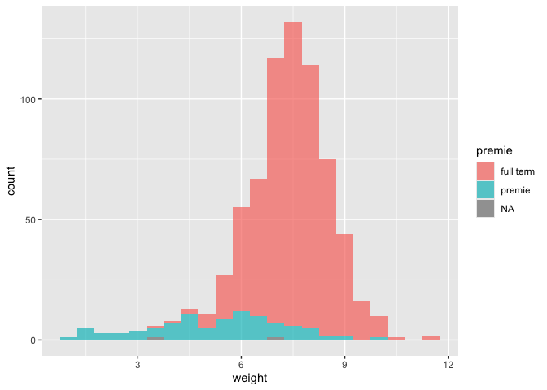
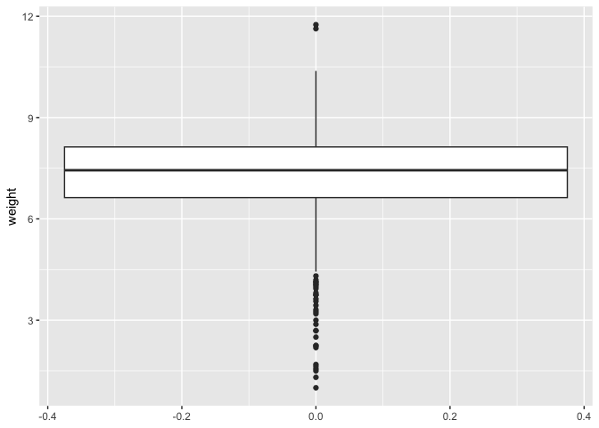
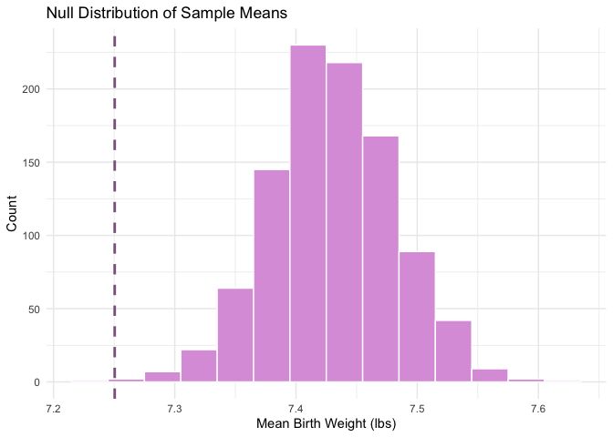
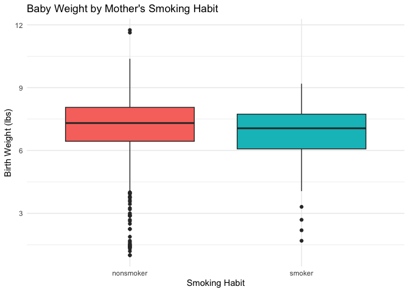
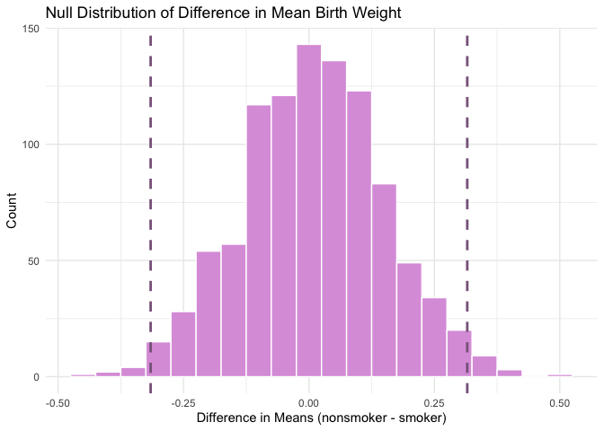

Lab 12 - Smoking during pregnancy
================
Anaelle Gackiere
03-27-2026

### Load packages and data

``` r
library(tidyverse) 
library(tidymodels)
library(openintro)
library(skimr)

# i'm setting my seed right before the bootstrap
```

# Baby Weights

### Exercise 1

Which variables in this dataset are numeric, and what do their
distributions look like? Are there any outliers or extreme values that
might affect your analysis?

The variables that are numeric in ncbirths are female age, male age,
weeks, visits, gained, weight. Mature, premie, lowbirthweight, gender,
habit, marital, whitemom are categorical. Gained seems to have extreme
values (from 0 pounds to 85 pounds) and it has 27 NAs. fage also has
many NAs (171). There are some outliers for a lot of the variables, and
we can already tell that smoking status changes some of the
distributions.

``` r
data(ncbirths)

summary(ncbirths)
```

    ##       fage            mage            mature        weeks             premie   
    ##  Min.   :14.00   Min.   :13   mature mom :133   Min.   :20.00   full term:846  
    ##  1st Qu.:25.00   1st Qu.:22   younger mom:867   1st Qu.:37.00   premie   :152  
    ##  Median :30.00   Median :27                     Median :39.00   NA's     :  2  
    ##  Mean   :30.26   Mean   :27                     Mean   :38.33                  
    ##  3rd Qu.:35.00   3rd Qu.:32                     3rd Qu.:40.00                  
    ##  Max.   :55.00   Max.   :50                     Max.   :45.00                  
    ##  NA's   :171                                    NA's   :2                      
    ##      visits            marital        gained          weight      
    ##  Min.   : 0.0   not married:386   Min.   : 0.00   Min.   : 1.000  
    ##  1st Qu.:10.0   married    :613   1st Qu.:20.00   1st Qu.: 6.380  
    ##  Median :12.0   NA's       :  1   Median :30.00   Median : 7.310  
    ##  Mean   :12.1                     Mean   :30.33   Mean   : 7.101  
    ##  3rd Qu.:15.0                     3rd Qu.:38.00   3rd Qu.: 8.060  
    ##  Max.   :30.0                     Max.   :85.00   Max.   :11.750  
    ##  NA's   :9                        NA's   :27                      
    ##  lowbirthweight    gender          habit          whitemom  
    ##  low    :111    female:503   nonsmoker:873   not white:284  
    ##  not low:889    male  :497   smoker   :126   white    :714  
    ##                              NA's     :  1   NA's     :  2  
    ##                                                             
    ##                                                             
    ##                                                             
    ## 

``` r
skimr::skim(ncbirths)
```

|                                                  |          |
|:-------------------------------------------------|:---------|
| Name                                             | ncbirths |
| Number of rows                                   | 1000     |
| Number of columns                                | 13       |
| \_\_\_\_\_\_\_\_\_\_\_\_\_\_\_\_\_\_\_\_\_\_\_   |          |
| Column type frequency:                           |          |
| factor                                           | 7        |
| numeric                                          | 6        |
| \_\_\_\_\_\_\_\_\_\_\_\_\_\_\_\_\_\_\_\_\_\_\_\_ |          |
| Group variables                                  | None     |

Data summary

**Variable type: factor**

| skim_variable  | n_missing | complete_rate | ordered | n_unique | top_counts         |
|:---------------|----------:|--------------:|:--------|---------:|:-------------------|
| mature         |         0 |             1 | FALSE   |        2 | you: 867, mat: 133 |
| premie         |         2 |             1 | FALSE   |        2 | ful: 846, pre: 152 |
| marital        |         1 |             1 | FALSE   |        2 | mar: 613, not: 386 |
| lowbirthweight |         0 |             1 | FALSE   |        2 | not: 889, low: 111 |
| gender         |         0 |             1 | FALSE   |        2 | fem: 503, mal: 497 |
| habit          |         1 |             1 | FALSE   |        2 | non: 873, smo: 126 |
| whitemom       |         2 |             1 | FALSE   |        2 | whi: 714, not: 284 |

**Variable type: numeric**

| skim_variable | n_missing | complete_rate | mean | sd | p0 | p25 | p50 | p75 | p100 | hist |
|:---|---:|---:|---:|---:|---:|---:|---:|---:|---:|:---|
| fage | 171 | 0.83 | 30.26 | 6.76 | 14 | 25.00 | 30.00 | 35.00 | 55.00 | ▃▇▇▂▁ |
| mage | 0 | 1.00 | 27.00 | 6.21 | 13 | 22.00 | 27.00 | 32.00 | 50.00 | ▃▇▇▂▁ |
| weeks | 2 | 1.00 | 38.33 | 2.93 | 20 | 37.00 | 39.00 | 40.00 | 45.00 | ▁▁▁▇▂ |
| visits | 9 | 0.99 | 12.10 | 3.95 | 0 | 10.00 | 12.00 | 15.00 | 30.00 | ▂▇▇▁▁ |
| gained | 27 | 0.97 | 30.33 | 14.24 | 0 | 20.00 | 30.00 | 38.00 | 85.00 | ▂▇▅▁▁ |
| weight | 0 | 1.00 | 7.10 | 1.51 | 1 | 6.38 | 7.31 | 8.06 | 11.75 | ▁▁▇▇▁ |

``` r
ncbirths %>%
  select(fage, mage, weeks, visits, gained, weight, habit) %>%
  filter(!is.na(habit)) %>%
  pivot_longer(cols = c(fage, mage, weeks, visits, gained, weight),
               names_to = "variable",
               values_to = "value") %>%
  ggplot(aes(x = habit, y = value, fill = habit)) +
  geom_boxplot() +
  facet_wrap(~variable, scales = "free_y") +
  labs(title = "Numeric Variable Distributions by Smoking Habit",
       x = NULL, y = NULL) +
  theme(legend.position = "none")
```

    ## Warning: Removed 205 rows containing non-finite outside the scale range
    ## (`stat_boxplot()`).

<!-- -->

### Exercise 2

The mean of the weights of the white mom’s babies in the dataset is 7.25
pounds.

``` r
ncbirths_white <- ncbirths %>%
  filter(whitemom == "white")

mean(ncbirths_white$weight, na.rm = TRUE)
```

    ## [1] 7.250462

### Exercise 3

The data is a random sample from NC birth records, so observations
should be independent. In terms of sample size, N = 714 is large enough
for bootstrapping since the threshold is typically n ≥ 30. The shape of
the distribution might pose some concerns; there is no extreme skew
(although there is a slight negative skew) but there may be some
clustering, since the tail of the distribution is essentially made up of
premies.

``` r
# graphical summaries
ggplot(ncbirths_white, aes(x = weight)) +
  geom_histogram(binwidth = 0.5)
```

<!-- -->

``` r
ggplot(ncbirths_white, aes(x = weight, fill = premie)) +
  geom_histogram(binwidth = 0.5, alpha = 0.7)
```

<!-- -->

``` r
ggplot(ncbirths_white, aes(y = weight)) +
  geom_boxplot()
```

<!-- -->

``` r
# samplesize
nrow(ncbirths_white)
```

    ## [1] 714

### Exercise 4

4a. Use bootstrapping to simulate a distribution of sample means from
ncbirths_white.

``` r
set.seed(51)

obs_mean <- mean(ncbirths_white$weight, na.rm = TRUE)

boot_means <- ncbirths_white %>%
  specify(response = weight) %>%
  generate(reps = 1000, type = "bootstrap") %>%
  calculate(stat = "mean")
```

4b. Shift the distribution so that its center aligns with the null
hypothesis value (7.43 pounds).

``` r
null_dist <- boot_means %>%
  mutate(stat = stat - mean(stat) + 7.43)
```

4c. Create a histogram of your shifted null distribution. Overlay a
dashed vertical line to show your observed sample mean.

``` r
null_dist %>%
  ggplot(aes(x = stat)) +
  geom_histogram(binwidth = 0.03, fill = "plum", color = "white") +
  geom_vline(xintercept = obs_mean, linetype = "dashed", color = "plum4", linewidth = 1) +
  labs(title = "Null Distribution of Sample Means",
       x = "Mean Birth Weight (lbs)", y = "Count") +
  theme_minimal()
```

<!-- -->

4d. Calculate the two-tailed p-value: what proportion of simulated means
are at least as extreme (in both directions) as your observed value?

``` r
null_dist %>%
  filter(stat <= obs_mean) %>%
  summarize(p_value = 2 * n() / nrow(null_dist))
```

    ## # A tibble: 1 × 1
    ##   p_value
    ##     <dbl>
    ## 1   0.002

4e. Based on the p-value (0.002) and the visualization, I would conclude
that birth weight has changed since 1995.

# Baby weight vs. smoking

### Exercise 5

Both groups have some low weight outliers, and the nonsmoker group has
some high weight outliers. Both groups have similar spread, with smokers
having a marginally wider IQR compared to nonsmokers. Nonsmokers have a
higher median birth weight than smokers. Based on the graph, smokers
have a lower SD than nonsmokers.

``` r
ncbirths %>%
  filter(!is.na(habit)) %>%
  ggplot(aes(x = habit, y = weight, fill = habit)) +
  geom_boxplot() +
  labs(title = "Baby Weight by Mother's Smoking Habit",
       x = "Smoking Habit", y = "Birth Weight (lbs)") +
  theme_minimal() +
  theme(legend.position = "none")
```

<!-- -->

### Exercise 6

Removing rows with missing values in either variable ensures that group
summaries are based only on complete observations. This prevents
functions from returning NA and ensures every observation can be
correctly assigned to a group.

``` r
ncbirths_clean <- ncbirths %>%
  filter(!is.na(habit), !is.na(weight))
```

### Exercise 7

The observed difference in mean birth weight between babies born to
smoking and non-smoking mothers is around -.32 lbs.

``` r
ncbirths_clean %>%
  group_by(habit) %>%
  summarize(mean_weight = mean(weight)) %>%
  summarize(diff = diff(mean_weight))
```

    ## # A tibble: 1 × 1
    ##     diff
    ##    <dbl>
    ## 1 -0.316

### Exercise 8

Hypotheses for testing whether smoking is associated with a difference
in birth weight:

Null Hypothesis: There is no difference in average birth weight between
babies born to smoking and non-smoking mothers.

H₀: μ₁ = μ₂

Alternative Hypothesis: There is a difference in average birth weight
between babies born to smoking and non-smoking mothers.

Hₐ: μ₁ ≠ μ₂

### Exercise 9

Permutation is the best choice here since it simulates the null
hypothesis directly by shuffling group labels.

``` r
# observed diff
obs_diff <- ncbirths_clean %>%
  group_by(habit) %>%
  summarize(mean_weight = mean(weight)) %>%
  summarize(diff = diff(mean_weight)) %>%
  pull()

# null dist via permutation
set.seed(51)
null_dist <- ncbirths_clean %>%
  specify(response = weight, explanatory = habit) %>%
  hypothesize(null = "independence") %>%
  generate(reps = 1000, type = "permute") %>%
  calculate(stat = "diff in means", order = c("nonsmoker", "smoker"))

# p value
null_dist %>%
  filter(stat >= abs(obs_diff) | stat <= -abs(obs_diff)) %>%
  summarize(p_value = n() / nrow(null_dist))
```

    ## # A tibble: 1 × 1
    ##   p_value
    ##     <dbl>
    ## 1   0.024

``` r
# Visual. Note 2 vertical lines since two tailed and with permutation it's centered at 0. 

null_dist %>%
  ggplot(aes(x = stat)) +
  geom_histogram(binwidth = 0.05, fill = "plum", color = "white") +
  geom_vline(xintercept = obs_diff, linetype = "dashed", color = "plum4", linewidth = 1) +
  geom_vline(xintercept = -obs_diff, linetype = "dashed", color = "plum4", linewidth = 1) +
  labs(title = "Null Distribution of Difference in Mean Birth Weight",
       x = "Difference in Means (nonsmoker - smoker)", y = "Count") +
  theme_minimal()
```

<!-- -->

### Exercise 10

Based on our confidence interval, we can say that we are 95% confident
that the true difference in mean birth weight between babies born to
nonsmoking and smoking mothers is between 0.09 and 0.60 lbs, with
nonsmokers having higher birth weights on average.

``` r
# now we can bootstrap
set.seed(51)
boot_dist <- ncbirths_clean %>%
  specify(response = weight, explanatory = habit) %>%
  generate(reps = 1000, type = "bootstrap") %>%
  calculate(stat = "diff in means", order = c("nonsmoker", "smoker"))

boot_dist %>%
  summarize(lower = quantile(stat, 0.025),
            upper = quantile(stat, 0.975))
```

    ## # A tibble: 1 × 2
    ##    lower upper
    ##    <dbl> <dbl>
    ## 1 0.0947 0.604

# Mother’s age vs. baby weight
